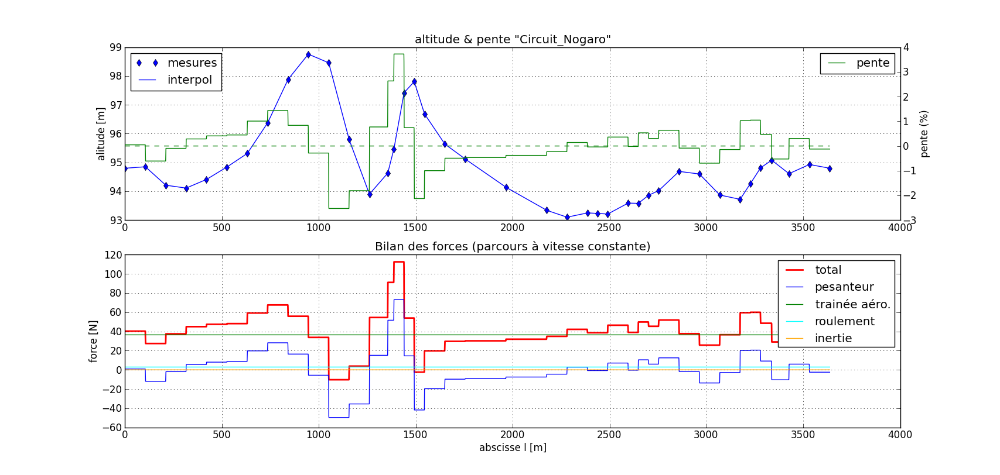

:::::::::::::::
Bilan d'énergie
:::::::::::::::

Bilan d'énergie sur le parcours d'un tour du circuit de Nogaro 3636
 * à une vitesse maintenue **constante** de 30 km/h = 8.3 m/s

Parcours à vitesse constante
============================

Bilan des forces
----------------

* Résistance au roulement : 2.9 N (constant)
* Résistance aérodynamique : 36.5 N en moyenne
* Pesanteur : 73.1 N max
* "Force" inertielle : 0.0 N max

Bilan d'énergie sur le tour
---------------------------

1. Énergie consommée mécaniquement : 143.3 kJ, dont :

  - résistance au roulement : 10.7 kJ
  - trainée aérodynamique : 132.6 kJ
  - variation d'énergie cinétique : 0.0 kJ

2. Pertes Joule dans le moteur : 33.2 kJ

**Énergie consommée au total: 176.4 kJ**

Parcours optimisé 1
===================

"best 0.977", généré après 10^5 itération, 
et des paramètres de recherche suivants :

::
    scale = np.random.rayleigh(0.004)
    phi = 1-10**np.random.uniform(-8,-2)

Bilan des forces
----------------
 - Résistance au roulement : 2.9 N (constant)
 - Résistance aérodynamique : 36.6 N en moyenne
 - Pesanteur : 73.1 N max
 - "Force" inertielle : 72.1 N max

Bilan d'énergie sur le tour
---------------------------

1. Énergie consommée mécaniquement : 143.9 kJ
dont : 
  - résistance au roulement : 10.7 kJ
  - trainée aérodynamique : 133.3 kJ
  - variation d'énergie cinétique : -0.1 kJ
2. Pertes Joule dans le moteur : 28.4 kJ

**Énergie consommée au total: 172.4 kJ**

*Et surtout :*
une réduction de près de 50 % de la force motrice maximale à fournir  !!

.. image:: ./analyse_vitesse_scale_0.004.png

